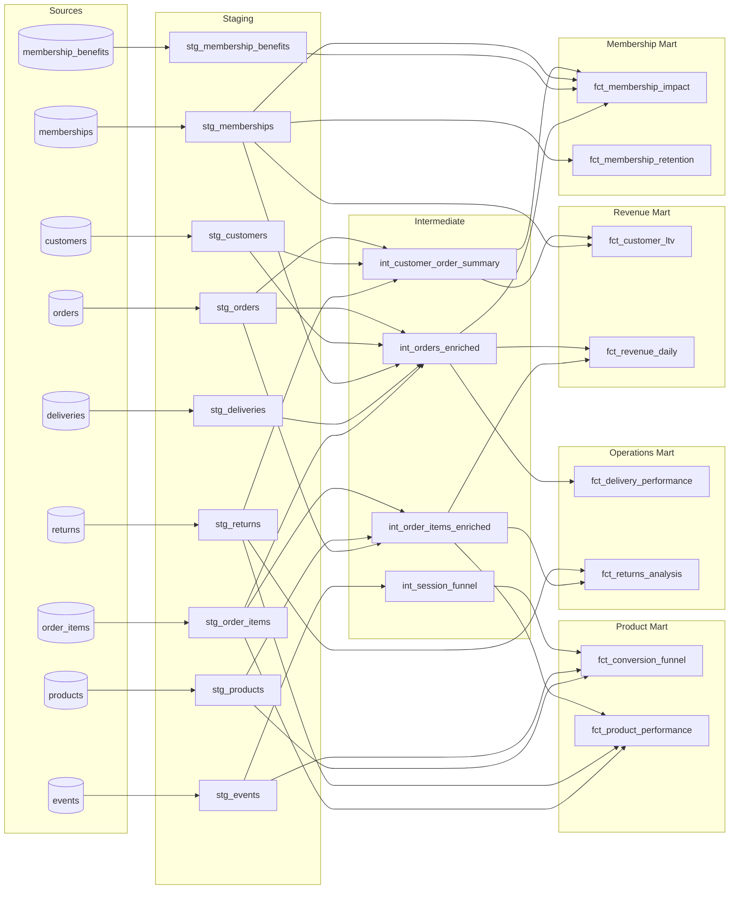

# Kaufly Analytics

dbt analytics pipeline for **Kaufly**, a fictional multi-category e-commerce platform serving customers across Germany, Austria, and Switzerland (DACH region).

The project models 18 months of synthetic e-commerce data through a three-layer dbt transformation pipeline (staging → intermediate → marts), producing analytical models across four business domains: **product**, **operations**, **revenue**, and **membership**.

## About Kaufly

Kaufly is a Berlin-based e-commerce platform offering fashion, electronics, and home & living products from over 2,000 brands. In 2024, Kaufly launched **Kaufly+**, a monthly membership programme (EUR 7.99/month) offering free standard delivery, 10% member discounts, early access to sales, and priority customer support.

## DAG



## Data

| Table | Records | Description |
|-------|---------|-------------|
| customers | 50,000 | Customer registrations across DE, AT, CH |
| orders | 130,000 | Orders with status, amounts, shipping |
| order_items | ~390,000 | Line items with product, quantity, price |
| events | 960,000 | Clickstream: page views, add-to-cart, checkout, purchase |
| products | ~2,000 | Fashion, electronics, home & living catalogue |
| deliveries | ~130,000 | Shipment tracking with carrier and dates |
| returns | ~13,000 | Return requests with reason and refund |
| memberships | ~9,300 | Kaufly+ subscriptions |
| membership_benefits | ~28,000 | Benefit usage (free delivery, discounts) |

Generated using a Python script (`scripts/generate.py`) that simulates realistic e-commerce patterns including seasonal spikes (Black Friday, Christmas), membership-driven behavioural differences, funnel drop-offs, and delivery variability across carriers and countries.

## Model architecture

### Staging (9 models)

Rename, cast, and compute lightweight derived columns from raw sources. Materialized as views.

| Model | Key computed columns |
|-------|---------------------|
| `stg_orders` | `net_amount`, `is_free_shipping` |
| `stg_deliveries` | `transit_days`, `delay_days`, `is_on_time` |
| `stg_memberships` | `tenure_days` |
| `stg_events` | `event_date` (from timestamp) |

### Intermediate (4 models)

Join and reshape staging models into reusable building blocks. Materialized as views.

| Model | What it does |
|-------|-------------|
| `int_orders_enriched` | Orders joined with customer country, delivery metrics, item counts, and whether the customer held a Kaufly+ membership at the time of purchase |
| `int_order_items_enriched` | Line items joined with product category/subcategory and order context |
| `int_customer_order_summary` | Per-customer lifetime metrics (orders, revenue, returns) with segment classification: `never_ordered`, `one_time`, `repeat`, `loyal` |
| `int_session_funnel` | Session-level conversion funnel with furthest stage reached (`page_view` → `product_view` → `add_to_cart` → `checkout_start` → `purchase`) and session duration |

### Marts (8 models)

Business-facing tables answering specific analytical questions. Materialized as tables.

**Product**

| Model | Answers |
|-------|---------|
| `fct_conversion_funnel` | What are the daily drop-off rates at each funnel stage, by product category? |
| `fct_product_performance` | Which products drive the most revenue, and which have the highest return rates? |

**Operations**

| Model | Answers |
|-------|---------|
| `fct_delivery_performance` | Which carriers hit SLA targets? How do transit times compare across countries and membership tiers? (includes median and p95) |
| `fct_returns_analysis` | What are the return rates by category and reason? How much refund value is at stake? |

**Revenue**

| Model | Answers |
|-------|---------|
| `fct_customer_ltv` | What is each customer's lifetime value? How do cohorts and segments compare? |
| `fct_revenue_daily` | What are the daily revenue trends by country, category, and membership status? (includes 7-day rolling aggregates) |

**Membership**

| Model | Answers |
|-------|---------|
| `fct_membership_impact` | Do Kaufly+ members spend more? What's the AOV uplift, and how much do members use their benefits? |
| `fct_membership_retention` | What are the cohort-level churn and retention rates by plan? |

## Tests

69 data tests covering uniqueness, not-null constraints, accepted values, and referential integrity across all three layers.

```
dbt test
# PASS=69 WARN=0 ERROR=0 SKIP=0 TOTAL=69
```

## Tech stack

| Component | Tool |
|-----------|------|
| Warehouse | PostgreSQL (local) |
| Transformation | dbt-core 1.12 |
| Data generation | Python |
| Adapter | dbt-postgres 1.10 |

## Setup

```bash
# 1. Clone
git clone https://github.com/basseat/kaufly-analytics.git
cd kaufly-analytics

# 2. Install dbt
pip install dbt-postgres

# 3. Create the database and load raw data
createdb kaufly
python scripts/generate.py          # generates CSVs in data/
psql -d kaufly -f scripts/load_raw.sql

# 4. Configure dbt connection
mkdir -p ~/.dbt
# Create ~/.dbt/profiles.yml with your PostgreSQL credentials:
# kaufly:
#   target: dev
#   outputs:
#     dev:
#       type: postgres
#       host: localhost
#       port: 5432
#       user: your_username
#       pass: ""
#       dbname: kaufly
#       schema: public
#       threads: 4

# 5. Run
dbt debug   # verify connection
dbt run     # build all 21 models
dbt test    # run all 69 tests
```

## Project structure

```
kaufly-analytics/
├── dbt_project.yml
├── scripts/
│   ├── generate.py              # synthetic data generator
│   └── load_raw.sql             # loads CSVs into PostgreSQL raw schema
└── models/
    ├── staging/
    │   ├── src_kaufly.yml        # source definitions + tests
    │   ├── stg_kaufly.yml        # model docs + tests
    │   ├── stg_customers.sql
    │   ├── stg_orders.sql
    │   ├── stg_order_items.sql
    │   ├── stg_products.sql
    │   ├── stg_events.sql
    │   ├── stg_deliveries.sql
    │   ├── stg_returns.sql
    │   ├── stg_memberships.sql
    │   └── stg_membership_benefits.sql
    ├── intermediate/
    │   ├── int_kaufly.yml
    │   ├── int_orders_enriched.sql
    │   ├── int_order_items_enriched.sql
    │   ├── int_customer_order_summary.sql
    │   └── int_session_funnel.sql
    └── marts/
        ├── product/
        │   ├── product.yml
        │   ├── fct_conversion_funnel.sql
        │   └── fct_product_performance.sql
        ├── operations/
        │   ├── operations.yml
        │   ├── fct_delivery_performance.sql
        │   └── fct_returns_analysis.sql
        ├── revenue/
        │   ├── revenue.yml
        │   ├── fct_customer_ltv.sql
        │   └── fct_revenue_daily.sql
        └── membership/
            ├── membership.yml
            ├── fct_membership_impact.sql
            └── fct_membership_retention.sql
```
